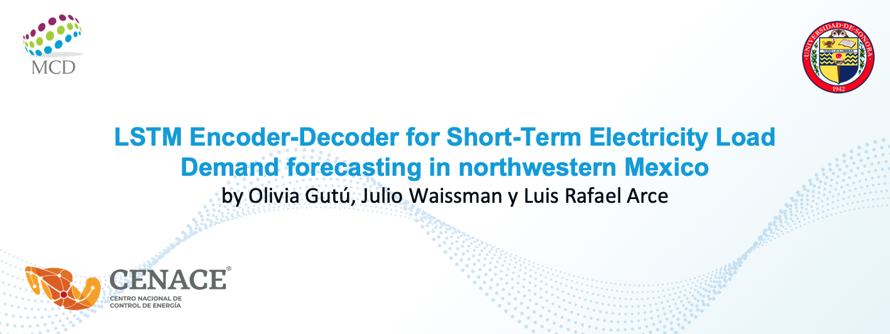

---

### Table of Contents

- [Description](#description)
- [Directory](#directory)
- [License](#license)
- [Author Info](#author-info)

---

## Description

This repository was elaborated within the framework of the General Academic-Institutional Col-
laboration Agreement between CENACE (Centro Nacional de Control de Energ ́ıa: https://www.
cenace.gob.mx/) and UNISON (Universidad de Sonora https://www.unison.mx/) on February 8,
2021. CENACE, as the institution in charge of operational control of the National Electric System, has, among many other tasks, to obtain a Short Term Load Forecasting (STLF) in northwestern Mexico, as accurate as possible within Day-Ahead Market.

CENACE has a forecasting system based on a “similar days” system that works as a sort
of nearest neighbors classification and consider some manually adjusted weights based on expert
knowledge and various variables such as week-day, holidays, maximum and minimum temperature,
precipitation, among others. In this repository we set an alternative methodology to estimate the STLF automatically through a LSTM encoder-decoder neural network. Unlike the CENACE methodology,
the weather forecast for the day to be forecast is not used as input. 

#### Technologies

- Python 3.8
- Tensorflow 2

[Back To The Top](#read-me-header)

---

## Directory

- EDA. Exploratory data analysis.

- sarimax. Baseline model.

- LSTM-ED.

- Comparativo. All LSTM-ED Variants.

- variants

    - LSTM-ED-RT.

    - LSTM-ED w/o PCA.

    - LSTM-ED w/o calendar ft. 

    - LSTM-ED w/o metereological ft.

---

## License

MIT License

Copyright (c) [2017] [James Q Quick]

Permission is hereby granted, free of charge, to any person obtaining a copy
of this software and associated documentation files (the "Software"), to deal
in the Software without restriction, including without limitation the rights
to use, copy, modify, merge, publish, distribute, sublicense, and/or sell
copies of the Software, and to permit persons to whom the Software is
furnished to do so, subject to the following conditions:

The above copyright notice and this permission notice shall be included in all
copies or substantial portions of the Software.

THE SOFTWARE IS PROVIDED "AS IS", WITHOUT WARRANTY OF ANY KIND, EXPRESS OR
IMPLIED, INCLUDING BUT NOT LIMITED TO THE WARRANTIES OF MERCHANTABILITY,
FITNESS FOR A PARTICULAR PURPOSE AND NONINFRINGEMENT. IN NO EVENT SHALL THE
AUTHORS OR COPYRIGHT HOLDERS BE LIABLE FOR ANY CLAIM, DAMAGES OR OTHER
LIABILITY, WHETHER IN AN ACTION OF CONTRACT, TORT OR OTHERWISE, ARISING FROM,
OUT OF OR IN CONNECTION WITH THE SOFTWARE OR THE USE OR OTHER DEALINGS IN THE
SOFTWARE.

[Back To The Top](#read-me-header)

---

## Authors Info

Olivia Carolina Gutú Ocampo
Profesor Titular
email: olivia.gutu@unison.mx

Julio Waissman Vilanova
Profesor Titular
email: julio.waissman@unison.mx

Luis Rafael Arce Rivera
Estudiante de la Maestría en Ciencia de Datos https://mcd.unison.mx/
email: rafa.arce@gmail.com

